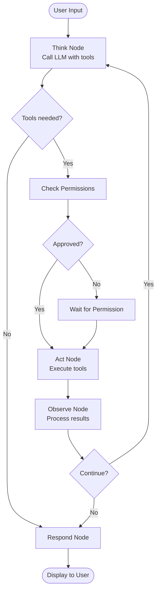

# TUI Code Agent (LangGraph)

An open-source, multi-model, extensible terminal coding agent built on [LangGraph](https://github.com/langchain-ai/langgraph). Feature-complete to match the capabilities of Claude Code, with a minimal REPL-style terminal interface powered by [Rich](https://github.com/Textualize/rich).

## Why LangGraph?

Unlike simple prompt-response loops, this agent uses LangGraph's **StateGraph** architecture to model the agent's reasoning as an explicit, inspectable graph with:

- **Checkpointing**: Save and resume sessions via MemorySaver (upgradeable to SQLite)
- **Human-in-the-loop**: Permission prompts can pause the graph via `interrupt()`
- **Streaming**: Token-by-token output via `astream_events`
- **Observability**: Every node transition is traceable and debuggable
- **Reliability**: Explicit state management prevents lost context and runaway loops

## Features

- **Multi-model support** - Switch between Anthropic, OpenAI, Google, and Ollama models on the fly
- **Claude Code style REPL** - Minimal terminal interface with spinner animation, streaming output, and status bar
- **Full coding toolkit** - 8 built-in tools: bash, file read/write/edit, glob, grep, web fetch, web search
- **Real-time streaming** - Token-by-token output via LangGraph's `astream_events`
- **Tool call visualization** - See tool names and outputs inline as they execute
- **Slash commands** - Quick actions: `/model`, `/cost`, `/clear`, `/compact`, `/exit`
- **Cost tracking** - Real-time token usage and cost estimation in the status bar
- **Session resume** - Resume previous conversations with `--resume <thread-id>`
- **Permission system** - Configurable auto-approve tiers for different tool categories
- **Loop safety** - Max iteration limit (default 50) prevents runaway tool loops

## Demo

```
╭──────────────────────────────────────────────────╮
│ TUI Code Agent - LangGraph-powered assistant     │
│ Type a message, /help for commands, Ctrl+C ×2    │
╰──────────────────────────────────────────────────╯
  branch:master
  anthropic:claude-opus-4-6 | session:42s | tokens:3.5k | $0.0128 | tools:5
  ────────────────────────────────────────
  ❯ Find all TODO comments in the codebase
  ────────────────────────────────────────
  ⠹ Running grep...
  ⚙ grep → Found 12 matches across 8 files
  
  Here are all the TODO comments I found...
```

## Architecture



### State Definition

```python
class AgentState(TypedDict):
    messages: Annotated[list[BaseMessage], add_messages]  # Auto-merged history
    tool_calls: list[dict]          # Pending tool calls from LLM
    tool_results: list[dict]        # Results from executed tools
    current_model: str              # Active model identifier
    current_provider: str           # Active provider name
    working_directory: str          # CWD for file/shell operations
    permission_pending: Optional[dict]  # Tool awaiting approval
    iteration_count: int            # Think-act-observe loop count
    total_tokens: int               # Cumulative session tokens
    total_cost: float               # Cumulative session cost (USD)
    turn_tokens: int                # Current turn tokens
    turn_cost: float                # Current turn cost
    error: Optional[str]            # Last error message
    metadata: dict                  # Extensibility metadata
```

## Installation

### From source (recommended)

```bash
git clone https://github.com/your-org/tui-code-agent-langgraph.git
cd tui-code-agent-langgraph

# Create a conda environment
conda create -n tui-agent-langgraph python=3.12 -y
conda activate tui-agent-langgraph

pip install -e .
```

## Quick Start

1. **Configure your API key** in `~/.tui-agent/config.json`:

```json
{
  "default_provider": "anthropic",
  "default_model": "claude-opus-4-6",
  "ANTHROPIC_API_KEY": "sk-ant-...",
  "ANTHROPIC_BASE_URL": "https://api.anthropic.com"
}
```

Or set environment variables:

```bash
export ANTHROPIC_API_KEY="sk-ant-..."
export OPENAI_API_KEY="sk-..."
export GOOGLE_API_KEY="AI..."
```

2. **Launch the agent:**

```bash
tui-agent
# or
python -m tui_agent
```

3. **Specify a model:**

```bash
tui-agent --provider openai --model gpt-4o
tui-agent --provider anthropic --model claude-opus-4-6
tui-agent --provider ollama --model llama3.1
```

4. **Resume a session:**

```bash
tui-agent --resume <thread-id>
```

## CLI Options

| Flag | Description |
|------|-------------|
| `--model, -m` | Model name (e.g., `gpt-4o`, `claude-opus-4-6`) |
| `--provider, -p` | Provider: `anthropic`, `openai`, `google`, `ollama` |
| `--resume, -r` | Resume a previous session by thread ID |
| `--workdir, -w` | Working directory (defaults to current) |
| `--version, -v` | Show version |

## Slash Commands

| Command | Description |
|---------|-------------|
| `/help` | Show available commands |
| `/model [provider:model]` | View or switch the active LLM |
| `/cost` | Show token usage and estimated cost |
| `/clear` | Clear the screen |
| `/compact` | Reset conversation (new thread) |
| `/exit` | Exit the agent |

## Tools

| Tool | Category | Description |
|------|----------|-------------|
| `bash` | Shell | Execute shell commands with timeout and working directory |
| `file_read` | File | Read file contents with line numbers, offset, and limit |
| `file_write` | File | Create or overwrite files, auto-creating directories |
| `file_edit` | File | Precise string replacement in files |
| `glob` | Search | Find files by glob pattern (e.g., `**/*.py`) |
| `grep` | Search | Regex content search (uses ripgrep when available) |
| `web_fetch` | Web | Fetch and extract text from URLs |
| `web_search` | Web | Search the web via DuckDuckGo |

### Permission Tiers

- **Auto-approved**: `file_read`, `glob`, `grep`, `web_fetch`, `web_search`
- **Requires approval**: `bash`, `file_write`, `file_edit`
- **Always blocked**: Destructive commands (`rm -rf /`, `mkfs`, etc.)

## How LangGraph Enables Key Features

### Checkpointing & Session Persistence

LangGraph's checkpointer serializes the entire graph state after each node execution:
- Sessions survive process restarts (with SQLite backend)
- Resume any conversation with `--resume <thread-id>`
- Default uses MemorySaver (in-process), upgradeable to SQLite/Postgres

### Human-in-the-Loop

When a tool requires permission, the graph can use LangGraph's `interrupt` mechanism to pause execution and wait for user approval before proceeding.

### Streaming via astream_events

LangGraph's `astream_events(version="v2")` provides fine-grained streaming:
- `on_chat_model_stream` - Token-by-token LLM output
- `on_tool_start` / `on_tool_end` - Tool execution lifecycle
- `on_chain_end` - State updates (tokens, cost)

### Loop Safety

The graph enforces a maximum iteration count (default 50) via the `after_observe` conditional edge, preventing runaway tool loops.

## Project Structure

```
src/tui_agent/
├── __main__.py          # CLI entry point
├── app.py               # Rich REPL application (Claude Code style)
├── config.py            # Configuration (JSON + env vars)
├── graph/               # LangGraph agent definition
│   ├── agent.py         # StateGraph construction & compilation
│   ├── state.py         # AgentState TypedDict (13 fields)
│   ├── nodes.py         # think, act, observe, respond nodes
│   ├── edges.py         # Conditional routing (should_use_tools, after_observe)
│   └── checkpointer.py  # MemorySaver setup (upgradeable to SQLite)
├── llm/                 # Multi-model provider layer
│   ├── provider.py      # Abstract base provider
│   ├── anthropic.py     # Claude provider
│   ├── openai.py        # GPT provider
│   ├── google.py        # Gemini provider
│   ├── ollama.py        # Local Ollama provider
│   └── registry.py      # Provider discovery & singleton registry
├── tools/               # Agent tools
│   ├── base.py          # AgentTool base class
│   ├── bash.py          # Shell execution
│   ├── file_read.py     # File reading
│   ├── file_write.py    # File creation
│   ├── file_edit.py     # File editing
│   ├── glob_tool.py     # File search
│   ├── grep.py          # Content search
│   ├── web_fetch.py     # URL fetching
│   ├── web_search.py    # Web search
│   └── registry.py      # Tool registry
├── ui/                  # Legacy Textual widgets (unused)
├── commands/            # Slash command handlers
│   ├── registry.py      # Command dispatch
│   ├── help.py, model.py, compact.py, clear.py
│   ├── cost.py, diff.py, config.py, commit.py
├── memory/              # State persistence
│   ├── conversation.py  # Thread ID & conversation management
│   └── persistent.py    # AGENT.md project memory
├── permissions/         # Permission system
│   └── manager.py       # Tool permission tiers
└── utils/
    ├── tokens.py        # Token counting (tiktoken + fallback)
    ├── cost.py          # Cost calculation & formatting
    └── git.py           # Async git helpers
```

## Multi-Model Support

| Provider | Models | API Key Env Var |
|----------|--------|-----------------|
| Anthropic | Claude Opus 4, Sonnet 4, 3.5 Sonnet, 3 Haiku | `ANTHROPIC_API_KEY` |
| OpenAI | GPT-4o, GPT-4o-mini, GPT-4 Turbo | `OPENAI_API_KEY` |
| Google | Gemini 2.0 Flash, 1.5 Pro, 1.5 Flash | `GOOGLE_API_KEY` |
| Ollama | Any locally installed model | `OLLAMA_BASE_URL` |

## Development

```bash
git clone https://github.com/your-org/tui-code-agent-langgraph.git
cd tui-code-agent-langgraph
pip install -e ".[dev]"

# Run tests
pytest

# Lint
ruff check src/
ruff format src/

# Type check
mypy src/
```

## Contributing

1. Fork the repository
2. Create a feature branch: `git checkout -b feature/my-feature`
3. Install dev dependencies: `pip install -e ".[dev]"`
4. Make your changes with tests
5. Run checks: `ruff check src/ && mypy src/ && pytest`
6. Submit a pull request

### Adding a New Tool

1. Create a new file in `src/tui_agent/tools/`
2. Subclass `AgentTool` with a Pydantic input schema
3. Implement `_arun` (async) and `_run` (sync fallback)
4. Register it in `tools/registry.py`

### Adding a New Provider

1. Create a new file in `src/tui_agent/llm/`
2. Subclass `LLMProvider` from `llm/provider.py`
3. Register it in `llm/registry.py`

### Adding a New Graph Node

1. Define an async function in `graph/nodes.py`
2. Add it to the graph in `graph/agent.py`
3. Add conditional edges in `graph/edges.py` if needed

## License

MIT License. See [LICENSE](LICENSE) for details.
